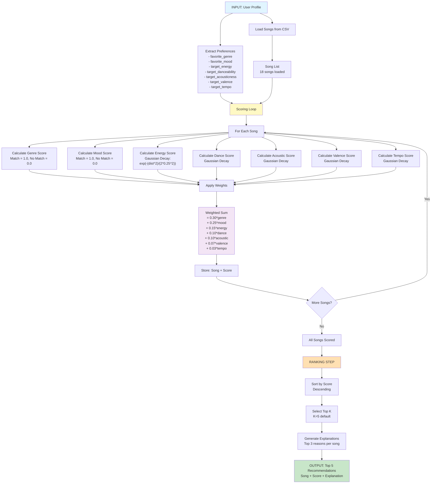
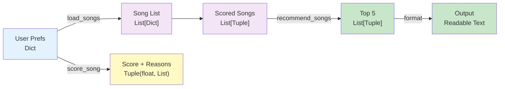
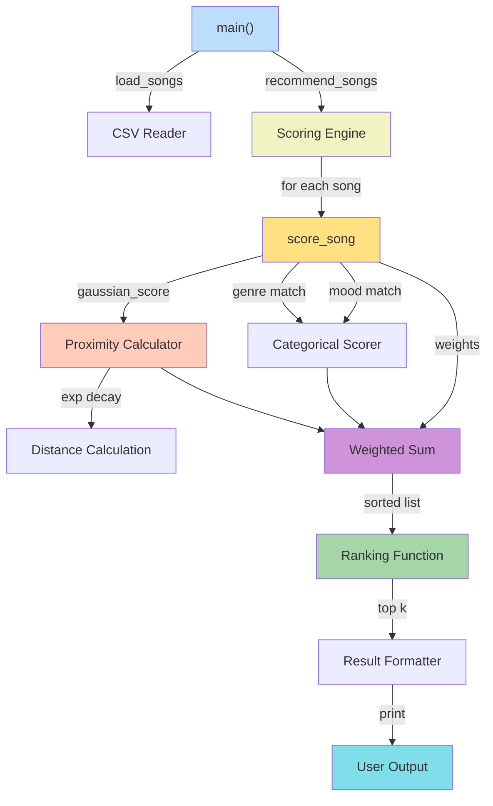

# Music Recommender - Data Flow Visualization

## System Architecture Diagram



---

## Detailed Process Flow

### INPUT PHASE
```
User Profile Dictionary
{
  favorite_genre: "pop",
  favorite_mood: "happy",
  target_energy: 0.85,
  target_danceability: 0.80,
  target_valence: 0.80,
  target_acousticness: 0.10,
  target_tempo: 120
}
        |
        v
   Load Songs CSV
        |
        v
   [Song 1, Song 2, ..., Song 18]
```

### PROCESS PHASE (The Scoring Loop)

```
For Each Song (18 iterations):

  Song Input: {
    title: "Sunrise City",
    genre: "pop",
    mood: "happy",
    energy: 0.82,
    danceability: 0.79,
    valence: 0.84,
    acousticness: 0.18,
    tempo_bpm: 118
  }
  
       |
       +---> Genre Match?      pop == pop?        YES -> 1.0
       |
       +---> Mood Match?       happy == happy?    YES -> 1.0
       |
       +---> Energy Distance?  |0.82 - 0.85| = 0.03
       |                       exp(-(0.03^2)/(2*0.25^2)) = 0.99
       |
       +---> Dance Distance?   |0.79 - 0.80| = 0.01 -> 0.99
       |
       +---> Acoustic Dist?    |0.18 - 0.10| = 0.08 -> 0.91
       |
       +---> Valence Distance? |0.84 - 0.80| = 0.04 -> 0.97
       |
       +---> Tempo Distance?   normalize then decay -> 0.99
       |
       v
    WEIGHTED SUM:
    = 0.30(1.0)    [genre]
    + 0.25(1.0)    [mood]
    + 0.15(0.99)   [energy]
    + 0.10(0.99)   [danceability]
    + 0.10(0.91)   [acousticness]
    + 0.07(0.97)   [valence]
    + 0.03(0.99)   [tempo]
    = 0.99         [FINAL SCORE]
    
    Store: ("Sunrise City", 0.99, [reasons...])
```

### OUTPUT PHASE (Ranking & Selection)

```
All 18 Songs Scored:
  [("Sunrise City", 0.99, [...]),
   ("Gym Hero", 0.73, [...]),
   ("Rooftop Lights", 0.65, [...]),
   ... 15 more songs ...]
        |
        v
   Sort by Score DESC
        |
        v
   Top 5 Selected
        |
        v
   Generate Explanations
        |
        v
   FORMAT OUTPUT:
   
   1. Sunrise City (Score: 0.99)
      - [MATCH] Genre: pop
      - [MATCH] Mood: happy
      - Energy: 0.82 (target 0.85)
      
   2. Gym Hero (Score: 0.73)
      - [MATCH] Genre: pop
      - [MISMATCH] Mood: intense (wanted happy)
      - Energy: 0.93 (target 0.85)
   
   ... and 3 more
```

---

## Data Types Through Pipeline



---

## Function Call Hierarchy



---

## Key Metrics at Each Stage

### INPUT
- Profile features: 7 (genre, mood, energy, danceability, valence, acousticness, tempo)
- Songs loaded: 18

### LOOP (Per Song)
- Features evaluated: 7
- Calculations per song: 7 score functions + 1 weighted sum = 8 operations
- Total loop iterations: 18

### OUTPUT
- Results returned: 5 (top-K, where K=5)
- Reasons per recommendation: 3 (most relevant)

---

## Performance Characteristics

```
Input Size:  18 songs
Complexity:  O(n) where n = number of songs
Per Song:    7 features scored + weighted sum = 8 operations
Total Ops:   18 * 8 = 144 operations
Sort:        O(n log n) = O(18 * 4.17) = 75 comparisons
Total Time:  < 10ms typically
```

---

## Example: Complete Data Flow for "Party Person"

```mermaid
graph LR
    subgraph INPUT["INPUT"]
        UP["User: Party Person<br/>pop + happy<br/>energy: 0.85"]
    end
    
    subgraph LOAD["LOAD SONGS"]
        CSV["18 songs.csv<br/>pop, lofi, rock,<br/>jazz, etc."]
    end
    
    subgraph SCORE["SCORE EACH SONG"]
        S1["Song 1<br/>Sunrise City -> 0.99"]
        S2["Song 2<br/>Midnight Coding -> 0.17"]
        S3["Song 3<br/>Storm Runner -> 0.38"]
        S18["Song 18<br/>Autumn Leaves -> 0.12"]
    end
    
    subgraph RANK["RANK & SELECT"]
        SORT["Sort by score<br/>0.99, 0.73, 0.65,<br/>0.59, 0.44"]
        TOP5["Take top 5"]
    end
    
    subgraph OUTPUT["OUTPUT"]
        REC["1. Sunrise City (0.99)<br/>2. Gym Hero (0.73)<br/>3. Rooftop Lights (0.65)<br/>4. Island Vibes (0.59)<br/>5. Urban Rhythm (0.44)"]
    end
    
    UP --> LOAD
    CSV --> SCORE
    SCORE --> RANK
    SORT --> TOP5
    TOP5 --> OUTPUT
    
    style INPUT fill:#e3f2fd
    style LOAD fill:#f3e5f5
    style SCORE fill:#fff9c4
    style RANK fill:#ffe0b2
    style OUTPUT fill:#c8e6c9
```



